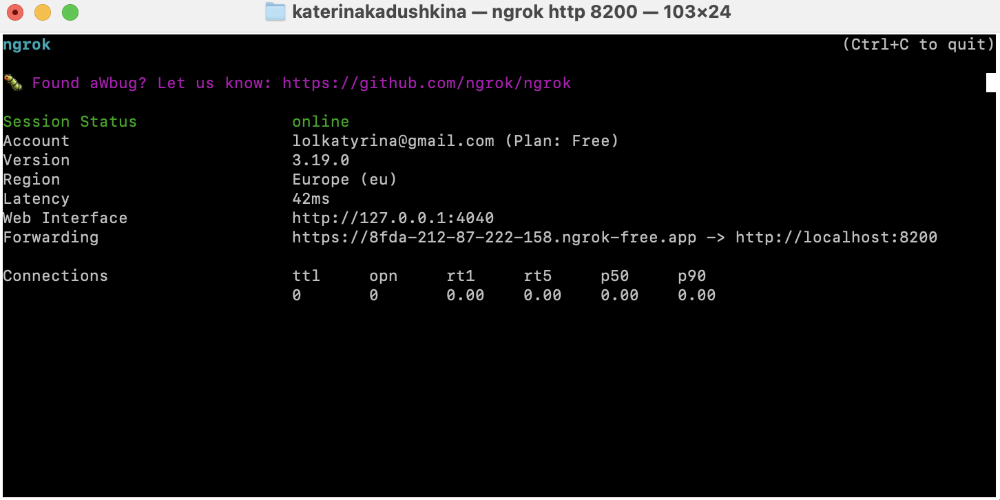

## 4 Лабораторная (со звездочкой)

### Задание

Сделать красиво работу с секретами. Например, поднять Hashicorp Vault и сделать так, чтобы ci/cd пайплайн (или любой другой ваш сервис) ходил туда, брал секрет, использовал его не светя в логах. В Readme аргументировать почему ваш способ красивый, а также описать, почему хранение секретов в CI/CD переменных репозитория не является хорошей практикой.


## Выполнение
### Vault

С помощью следующих команд был установлен vault:
```bash
brew tap hashicorp/tap
brew install hashicorp/tap/vault
```

Проверка, что Vault установлен и работает:
```bash
vault --version
```

Далее был запущен vault в dev-режиме:
```bash
vault server -dev
```


Для инициализации Valt в отдельном терминале было выполнено:
```bash
export VAULT_ADDR='http://127.0.0.1:8200'
vault login <Root Token>
```

Где вместо Root Token был написан токен, выданный при запуске Vault.

После этого был создан секрет:
```bash
vault kv put secret/my-secret secret_key="supersecretvalue"
```


Проверка, что секрет сохранен:
```bash
vault kv get secret/my-secret
```


### ngrok
Так как Vault поднимается локально, он доступен только с моего компьютера (на http://127.0.0.1:8200). Если CI/CD пайплайн запускается на удаленном сервере (например, в GitHub Actions), ему нужен доступ к Vault через внешний URL. Здесь нам и нужен ngrok. Он пробрасывает порт локального Vault и предоставляет временный публичный URL, чтобы удаленные сервисы могли взаимодействовать с ним.

Установка ngrok:
```bash
brew install ngrok/ngrok/ngrok
```

Авторизация в ngrok:
```bash
ngrok config add-authtoken <токен>
```

Проброска порта:
```bash
ngrok http 8200
```



Мы получили временный URL.

### CI/CD
<details>
  <summary>Здесь код CI/CD</summary>

    name: Vault CI/CD Example

    on: [push]

    jobs:
    test:
        runs-on: ubuntu-latest

        steps:
        - name: Checkout Code
        uses: actions/checkout@v4

        - name: Install jq
        run: sudo apt-get install -y jq

        - name: Get Secret from Vault
        env:
            VAULT_ADDR: ${{ secrets.VAULT_ADDR }}
            VAULT_TOKEN: ${{ secrets.VAULT_TOKEN }}
        run: |
            echo "Fetching secret from Vault..."
            SECRET=$(curl --silent --header "X-Vault-Token: $VAULT_TOKEN" \
            --request GET "$VAULT_ADDR/v1/secret/data/my-secret" | jq -r '.data.data.secret_key')
            echo "Secret fetched successfully!"

            if [ -z "$SECRET" ]; then
            echo "Failed to fetch secret!"
            exit 1
            fi

            echo "SECRET=$SECRET" >> $GITHUB_ENV

        - name: Use Secret
        env:
            SECRET: ${{ env.SECRET }}
        run: |
            echo "Using secret safely..."
            echo "The secret is: $SECRET"
</details>

Пришлось немного потупить с синтаксисом, но мне подсказали https://www.yamllint.com/, поэтому тупить пришлось не долго.

В GitHub Secrets я спрятала переменные для токена и для ссылки на Vault.


Ну и фсо. CI/CD подтягивает секреты по белому ip и теперь их можно использовать, как хочется.


### Почему хранение секретов в переменных CI/CD репозитория — плохая практика?

- Если кто-то получит доступ к репозиторию, он также сможет получить доступ к секретам, поскольку они сохраняются в конфигурации репозитория. Особенно опасно, если у репозитория есть множество пользователей с разными уровнями прав.


- При изменении секрета невозможно отследить, кто и когда его обновил, если это делается вручную через настройки CI/CD.

- Если секреты изменились, их нужно вручную обновлять в каждом репозитории, что затрудняет их ротацию.

- При большом количестве проектов или команд управление секретами через переменные репозитория становится сложным.
